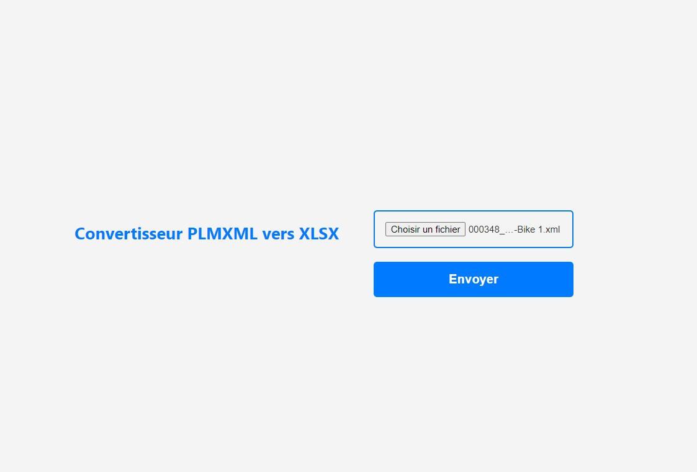

# 
Convertisseur PLMXML en XLSX

  
    
Description
Cette application Flask permet aux utilisateurs d'importer des fichiers PLMXML et de génèrer des fichiers Excel. Chaque fichier Excel est créé avec un tableau structuré. Il faudra manuellement sur le fichier Excel cliquer sur tableau pour obtenir des en-têtes et des filtres automatiques, facilitant ainsi l'analyse des données.

        
# 
🧐 Fonctionnalités

  
- Téléchargement de fichiers PLMXML via une interface web.

- Traitement automatique des fichiers PLMXML.

- Génération de fichiers Excel avec des données structurées sous forme de tableaux.

## 
🛠️ Installation 
   

- Clonez le dépôt Git: https://github.com/sophieCap/plmxml-app.git
- installer Python

Sur le terminal taper ces lignes de commandes : 
- pip install Flask
- pip install pandas
- pip install openpyxl
- pip install xlsxwriter
- pip install -r requirements.txt

Exécutez le script Python pour démarrer le serveur Flask ==> python xmlxls.py

Accédez à l'application:
Ouvrez votre navigateur et allez à http://localhost:5000 (ou à l'adresse IP configurée).

Téléchargez un fichier XML:
Utilisez l'interface web pour télécharger un fichier XML. Une fois le fichier téléchargé et traité, un fichier Excel formaté sera automatiquement téléchargé sur votre appareil.

# 
Visualisation du site : 

  
